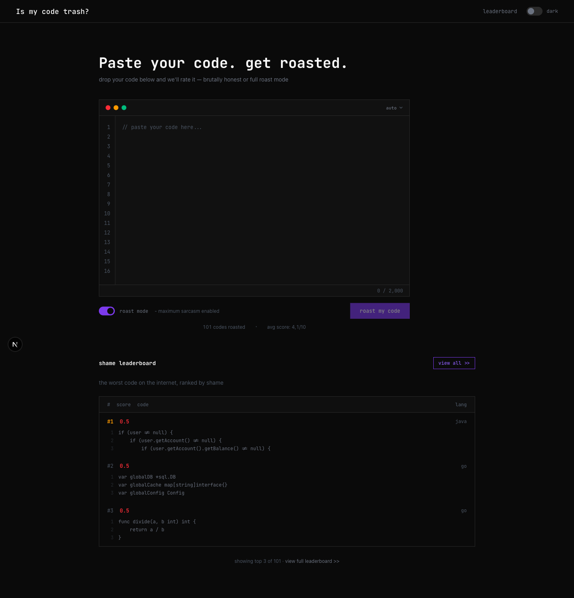
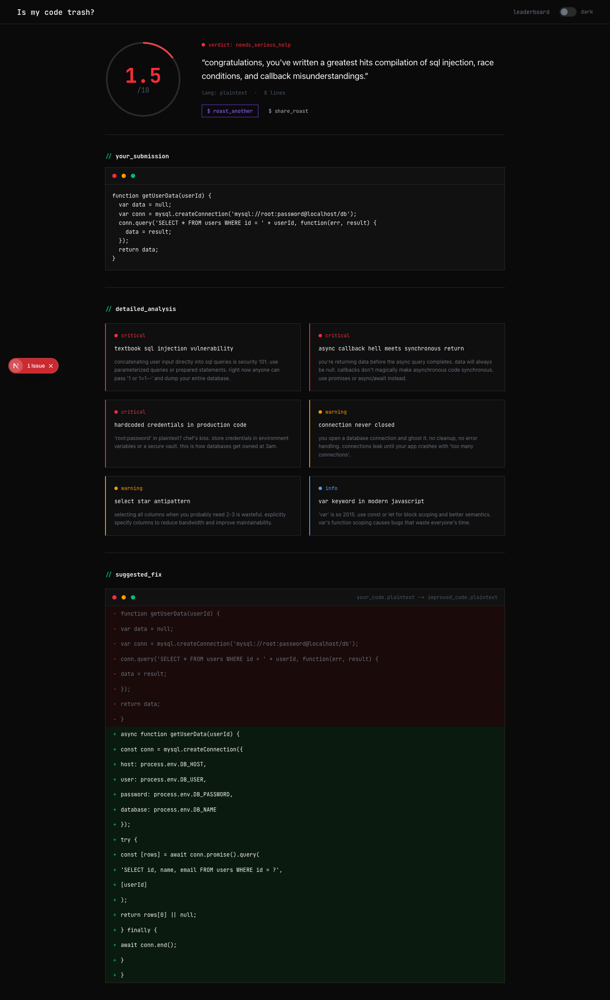
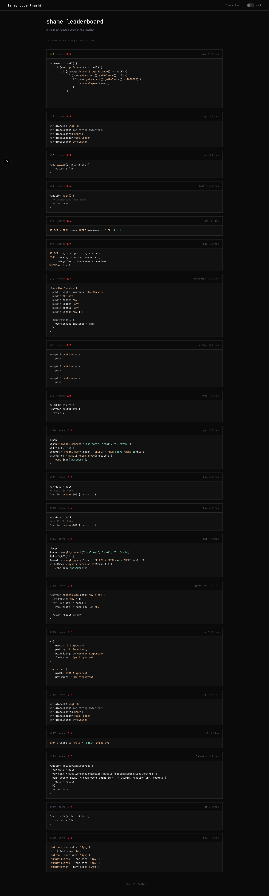

# CodeRoaster

CodeRoaster is a web app that brutally judges your code. Paste any snippet, get an AI-powered roast with a shame score, and watch your worst code end up on a public leaderboard for everyone to see.

## Screenshots

**Homepage — code editor with roast mode toggle and live stats**


**Roast result — score ring, verdict, detailed analysis and suggested fix diff**


**Shame leaderboard — top 20 worst code snippets with syntax highlighting**


---

## Features

**Code Roasting** — Submit any code snippet and receive an unfiltered AI critique powered by Claude. Points out every bad practice, antipattern, and questionable decision — with optional maximum sarcasm mode.

**Roast Mode** — Toggle between honest critique and full sarcasm. Roast mode cranks up Claude's tone to brutal, deadpan contempt for your architectural decisions.

**Shame Score** — Each roast produces a score from 0.0 to 10.0 reflecting just how bad the code is. Lower scores mean deeper shame.

**Verdicts** — Five tiers of shame: `excellent`, `acceptable`, `mediocre`, `needs_help`, `needs_serious_help`.

**Detailed Analysis** — Up to 6 categorized issues (critical, warning, good, info) with titles and explanations.

**Suggested Fix** — When the AI finds a clear improvement, it produces a unified diff showing exactly what to change.

**Leaderboard** — The worst submissions are immortalized in a public hall of shame, ranked by score, cached hourly.

**Shareable OG Images** — Every roast result generates a dynamic Open Graph image (1200×630 WebP) automatically, so sharing a link on Twitter, Discord, or Slack shows a beautiful preview card with the score and verdict.

**Syntax Highlighting** — The code editor detects the language automatically (highlight.js) and renders with Shiki on the server.

**Animated Stats** — Live counters for total roasts and average score animate from zero on load using NumberFlow.

---

## Tech Stack

| Layer | Tools |
|---|---|
| Framework | Next.js 16 (App Router, Turbopack, Cache Components) |
| UI | React 19, Tailwind CSS v4, tailwind-variants |
| AI | Vercel AI SDK + Anthropic Claude (`claude-sonnet-4-5`) |
| API | tRPC v11 + TanStack React Query |
| Database | PostgreSQL 16 via Drizzle ORM |
| Caching | `"use cache"` + `cacheLife("hours")` on data functions |
| OG Image generation | Takumi (`@takumi-rs/image-response`) — JSX → WebP via Rust engine |
| Syntax highlight | Shiki v4 (server-side) + highlight.js (auto-detection) |
| Animation | NumberFlow |
| Primitives | @base-ui/react |
| Linting | Biome |

---

## Built with an Agentic AI Workflow

> This project was designed and implemented end-to-end using an **agentic AI workflow** — not just AI-assisted autocomplete, but a full autonomous agent loop with tools, skills, and MCP integrations.

### Tools & Platforms

| Tool | Role |
|---|---|
| **[OpenCode](https://opencode.ai)** | Agentic coding environment that orchestrated the entire development session |
| **Claude API (Anthropic)** | The AI agent powering both the coding workflow (`claude-sonnet-4-6`) and the roast feature itself (`claude-sonnet-4-5`) |
| **[Pencil](https://pencil.new)** | AI-first design tool used to create all UI mockups and the OG image frame |
| **MCP (Model Context Protocol)** | Used to connect the AI agent directly to the Pencil design file, reading frame data, design tokens, color variables, and layout structure in real time |
| **Claude Code CLI** | Anthropic's official CLI used as the primary coding agent — reading, writing, and editing files autonomously |

### How the agentic loop worked

1. The UI was designed in **Pencil** — screens, components, color tokens, spacing, the OG image frame
2. The AI agent connected to the Pencil file via **MCP** (Model Context Protocol), reading node trees, design variables, and screenshots directly as tool calls
3. **OpenCode** orchestrated the agent session — managing context, tool use, file edits, and multi-step tasks
4. The agent used **skills** (specialized instruction sets) and **tools** (bash, file read/write, web fetch, design inspection) to implement the entire codebase autonomously
5. Every decision — architecture, naming, caching strategy, OG image design — was driven by the agent reading the actual design source and the project's own `AGENTS.md` guidelines

This is a real example of **agentic software development**: the AI didn't just suggest code snippets — it planned tasks, read existing files, explored documentation, made decisions, and shipped working features end-to-end.

---

## Running locally

**Prerequisites:** Node.js ≥ 20, Docker

```bash
nvm use 20
npm install

# Start the database
docker compose up -d

# Apply migrations
npm run db:migrate

# (Optional) Seed with sample data
npm run db:seed

npm run dev
```

Open `http://localhost:3000`.

---

## Environment variables

> **The app will not work without these set in `.env.local`.**

Copy `.env.example` to `.env.local` and fill in the values:

```bash
cp .env.example .env.local
```

| Variable | Required | Description |
|---|---|---|
| `DATABASE_URL` | **Yes** | PostgreSQL connection string |
| `ANTHROPIC_API_KEY` | **Yes — the app won't roast anything without this** | Your Anthropic API key. Get one at [console.anthropic.com](https://console.anthropic.com) |
| `NEXT_PUBLIC_BASE_URL` | Yes (for OG images) | The public URL of your deployment, e.g. `https://coderoaster.dev` |

### Getting your Anthropic API key

1. Go to [console.anthropic.com](https://console.anthropic.com)
2. Create an account and add a payment method
3. Generate an API key under **API Keys**
4. Add it to `.env.local`:

```env
ANTHROPIC_API_KEY="sk-ant-api03-..."
```

Without this key, the `/api/roast` action will throw and no roasts will be generated.

---

## Production checklist

Things you **must** configure before going live:

- [ ] **`ANTHROPIC_API_KEY`** — set in your hosting provider's environment variables (Vercel, Railway, Fly.io, etc.). The app is completely non-functional without it.
- [ ] **`DATABASE_URL`** — point to a production PostgreSQL instance (e.g. Neon, Supabase, Railway Postgres). Do not use the local Docker instance in production.
- [ ] **`NEXT_PUBLIC_BASE_URL`** — set to your production domain (e.g. `https://coderoaster.dev`). Without this, the `og:image` meta tag will contain a relative URL and Twitter/Discord/Slack embeds will not show the preview image.
- [ ] **Run migrations** — after deploying, run `npm run db:migrate` against your production database before the first request.
- [ ] **Review `cacheLife` values** — leaderboard and stats are cached for 1 hour by default. Adjust in `src/db/queries/` if needed.
- [ ] **Rate limiting** — the roast endpoint calls the Anthropic API on every submission. Consider adding rate limiting (e.g. Upstash Ratelimit) to avoid runaway costs.

---

## Database scripts

```bash
npm run db:generate   # generate migrations from schema changes
npm run db:migrate    # apply migrations
npm run db:push       # push schema directly (dev only)
npm run db:studio     # open Drizzle Studio
npm run db:seed       # seed with fake data
```

---

## Project structure

```
src/
  app/
    actions/        # Server Actions (roast submission)
    api/
      og/[id]/      # GET /api/og/:id — dynamic OG image via Takumi
      trpc/         # tRPC fetch adapter
    leaderboard/    # Leaderboard page
    roast/[id]/     # Roast result page (generateMetadata injects og:image)
  components/       # Feature components (HomepageStats, RoastForm, etc.)
    ui/             # Primitive UI components (Button, Badge, CodeBlock, etc.)
  db/
    queries/        # Drizzle query functions (roast.ts, stats.ts, leaderboard.ts)
    schema.ts       # Tables, enums, inferred types
  lib/
    ai.ts           # analyzeCode() — Claude integration via AI SDK
    languages.ts    # Language list and hljs→Shiki mapping
  trpc/
    routers/        # tRPC procedures (stats, leaderboard)
    server.tsx      # caller, HydrateClient, prefetch (server-only)
    client.tsx      # TRPCReactProvider, useTRPC (client-only)
public/
  fonts/            # JetBrains Mono TTF files (used by Takumi for OG images)
specs/              # Feature specs written before implementation
```
